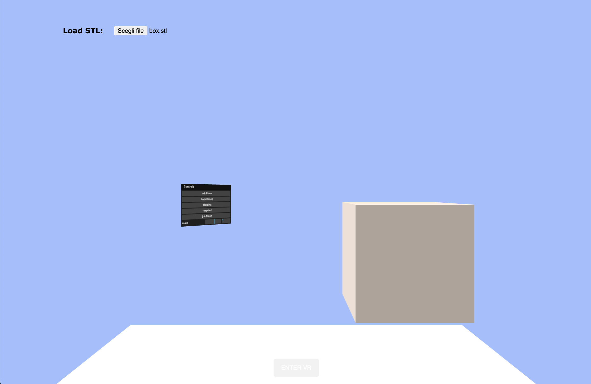
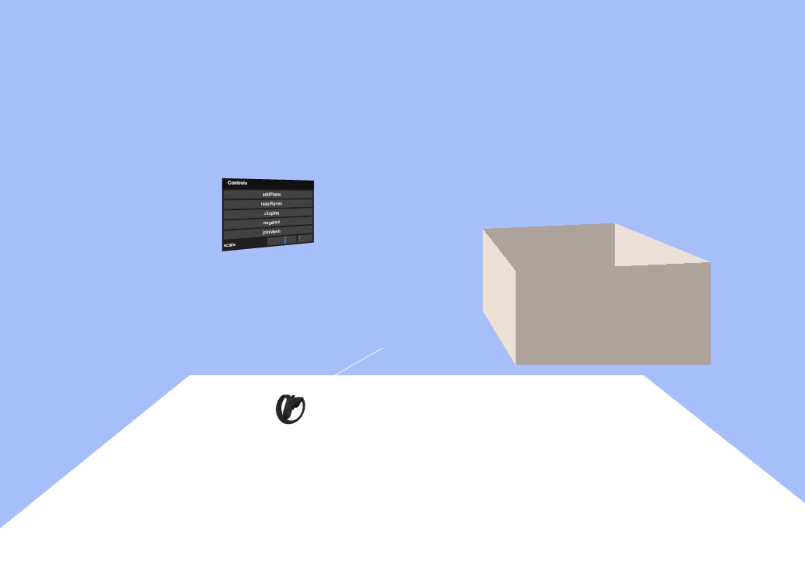

# Three Clipping VR

The clipping function of the project [threejs-clipping](https://github.com/AngyDev/threejs-clipping) applied in a VR project

## Demo

https://clipping-vr.netlify.app/

## Functionalities

- Import an STL file
- Add planes
- Hide planes
- Clipping
- Nagate clipping
- Join mesh, with this function is possible to move all the objects in the scene together
- Scale the selected object
